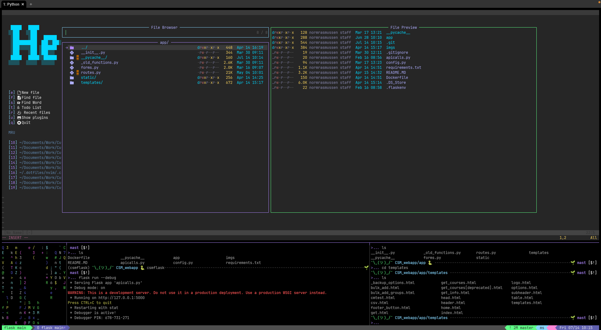
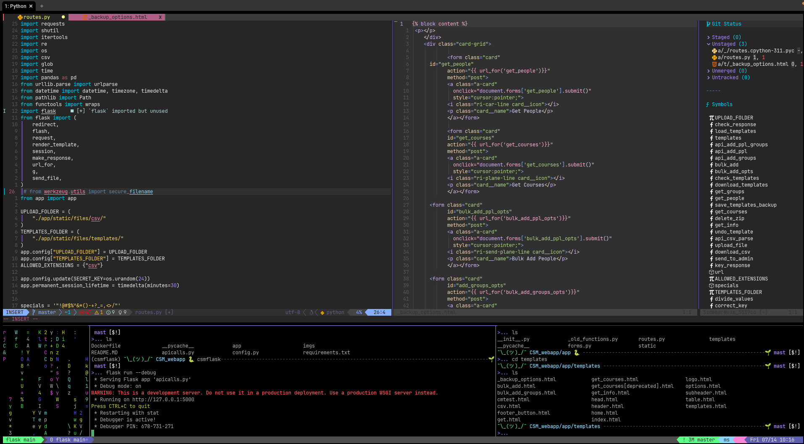
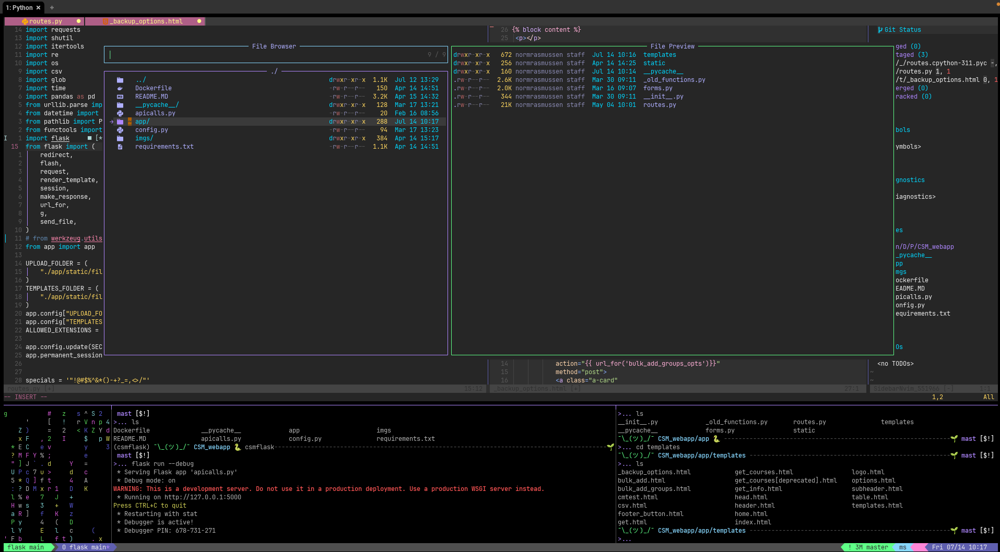
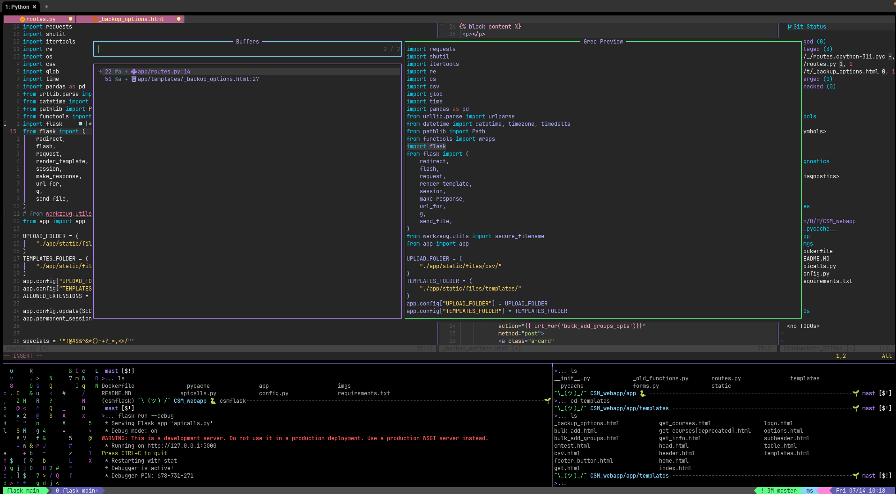

 ```
 _   _                                _
 | \ | |                              (_)
 |  \| |  ___   _ __  _ __ ___ __   __ _  _ __ ___
 | . ` | / _ \ | '__|| '_ ` _ \\ \ / /| || '_ ` _ \
 | |\  || (_) || |   | | | | | |\ V / | || | | | | |
 |_| \_| \___/ |_|   |_| |_| |_| \_/  |_||_| |_| |_|
```

 ### Welcome to my setup

Most of the times I'm writing in Markdown or Python. I'll also manage my servers from a similar environment which is mostly yaml and bash scripts. Here's a few images.


&nbsp;

&nbsp;

&nbsp;

&nbsp;

